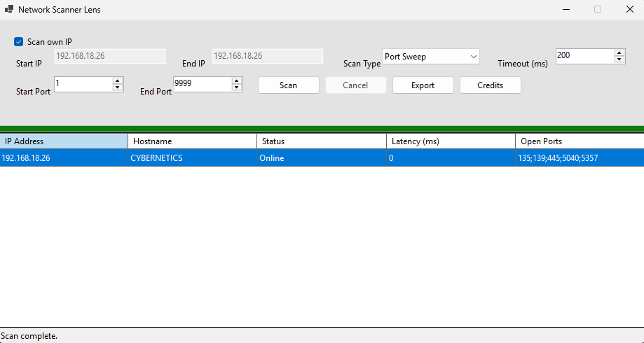

# Network Scanner Lens

Dead simple desktop app for basic network scanning.
Had fun with with **.NET WinForms**.

---

## What this app does

Network Scanner Lens is a small utility to:

* Ping single IP or IP range
* Detect online hosts
* Resolve hostname
* Optional port sweep (TCP)
* Export result to CSV
* Cancel scan anytime

Made for learning purpose.

---

## Features

* Scan own IP automatically
* Ping-based host detection
* Latency measurement
* Hostname resolving (DNS)
* Port sweep with custom range
* Progress bar + status info
* CSV export
* Simple Credits window, reusable procedure.

---
## How to use

1. Run the app
2. Choose scan type (Ping / Port Sweep)
3. Enter Start IP & End IP

   * or check **Scan own IP**
4. (Optional) set port range
5. Click **Scan**
6. Export result if needed

Cancel button works during scan.
---
## Scan Types
* **Ping**
  Just check if host is alive.
* **Port Sweep**
  Ping first, then scan TCP ports if host is online.
---

## What's inside?

* .NET Desktop (WinForms)
* C#
* Async / Task-based scanning
* TcpClient for port checking
* Ping + DNS resolve

No external lib.

## License

Free to use for learning.
Do whatever, just don’t be weird.